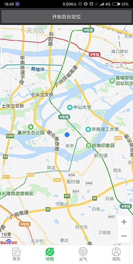
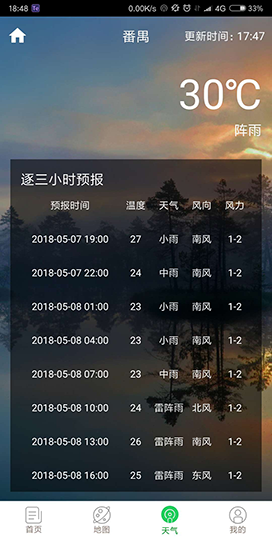

# Traffic Ease 客户端（积极开发中……）

## Traffic Ease v1.1.1

“Traffic Ease”是一款基于百度地图SDK的智慧出行APP。用户通过此款APP，即可规划出行路线，记录出行轨迹，路线导航，查询公交实时信息，了解出行天气状况，选择酒店、餐厅、停车场等。同时也可以通过各大社交平台转发自己的出行动态，分享出行的实时路况以及出行攻略。

随着人类社会的不断发展，人们生活已步入新时代，社会主要矛盾已经转化为人民日益增长的美好生活需要和不平衡不充分的发展之间的矛盾。出行作为“衣食住行”其中一个重要维度，直接影响着人们生活的幸福指数。当下，人们出行通常需要考虑很多问题（如天气，出行时间，交通工具，停车场，出行耗时等），需要一款应用帮助人们从日常紧张忙碌的生活节奏中解脱出来，不用再手动从多个应用、网站、渠道中通过找寻筛选来获取相关出行信息。此时，“Traffic Ease”应运而生了。

## 数据来源

- 地图来源：百度地图
- 天气来源：和风天气
- 背景图来源：必应图片（每日一图）

## 应用截图

## 历史版本

| 序号 | 版本号 | 说明 |
|---|--------|-----------|
| 1 | v1.0.0 | 前期准备 & 统一开发环境 |
| 2 | v1.0.1 | 实现登录注册功能 & 接入SMS短信验证码功能 & 接入百度地图SDK |
| 3 | v1.0.2 | 主框架-底部Fragment导航栏实现 & 登录页面使用SharedPreferences优化用户体验 |
| 4 | v1.0.3 | 天气Fragment demo实现 & 天气来源：和风天气 |
| 5 | v1.1.0 | 基于和风天气认证开发者接口重写WeatherFragment & MapFragment定位功能实现 |
| 6 | v1.1.1 | 初步实现MimeFragment个人静态页面 |

## 最新版开发环境

1. Android Studio >= 3.0.1
2. Gradel Version: 4.1
3. Gradle Plugin Version: 3.0.1
4. minSdkVersion：21
5. targetSdkVersion 26

## 相关依赖

		// 百度地图SDK
	    compile files('libs/BaiduLBS_Android.jar')
	    // butterknife 框架
	    compile 'com.jakewharton:butterknife:8.8.1'
	    annotationProcessor 'com.jakewharton:butterknife-compiler:8.8.1'
	    // umeng 集成友盟SDK
	    compile 'com.umeng.analytics:analytics:latest.integration'
	    // glide 框架
	    compile 'com.github.bumptech.glide:glide:3.7.0'
	//    implementation 'com.github.bumptech.glide:glide:4.6.1'
	//    annotationProcessor 'com.github.bumptech.glide:compiler:4.6.1'
	    // recyclerview、v4包 和 v13包,注意版本一致
	    implementation 'com.android.support:recyclerview-v7:27.0.0'
	    compile 'com.android.support:support-v4:27.0.0'
	    compile 'com.android.support:support-v13:27.0.0'
	    // gson
	    compile 'com.google.code.gson:gson:2.8.2'
	    // 网络封装类 okhttp 与 retrofit
	    compile 'com.squareup.okhttp3:okhttp:3.9.1'
	    compile 'com.squareup.retrofit2:retrofit:2.3.0'
	    compile 'com.squareup.retrofit2:converter-gson:2.3.0'
	    // litepal
	    compile 'org.litepal.android:core:1.6.1'
	    //
	    implementation 'de.hdodenhof:circleimageview:2.2.0'

## 系统设计

- 服务器端：Spring Boot
- 数据库：MySQL5.7
- JDK版本：1.8

## 目标

需求分析，功能点，界面需求
界面设计，草图
数据库设计
系统设计，模块设计，关键技术
详细设计，图表